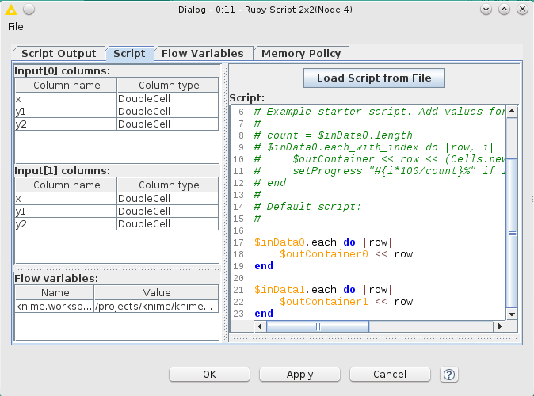
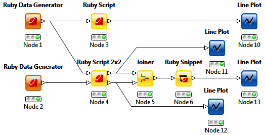
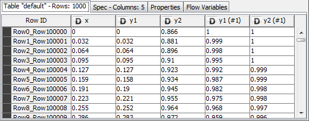
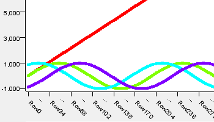
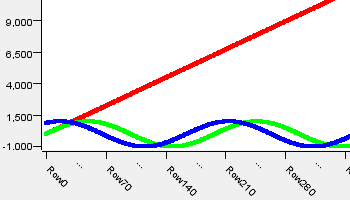
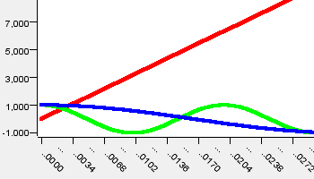
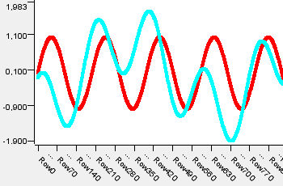

ruby4knime
==========

[](https://gitter.im/rssdev10/ruby4knime?utm_source=badge&utm_medium=badge&utm_campaign=pr-badge&utm_content=badge)

## Intro
Ruby scripting extension for [KNIME](http://knime.org)

This is preliminary support of Ruby scripting language for Knime.

Now realized following node types:

* Ruby Generator allows to generate any string or numeric data. Or process any external sources using Ruby.
* Ruby Script allows to process input DataTable into output DataTable.
* Ruby Script 2x2 allows to process 2 input DataTable into 2 output DataTable.
* Ruby Snippet allows to process input DataTable into output DataTable by writing code only for one row processing.

It is possible to configure an Output table with any types of columns.

See [Ruby wrapper](RubyScript/rb/README.rdoc)




## Installation
[Download binary](../../releases/)

See [changelog](CHANGELOG.md).


Install this archive as [KNIME extension](http://www.knime.org/downloads/update).

## Sample workflow
[Download sample workflow](samples/KNIME_Ruby_Test.zip)

This is simple workflow for ruby4knime testing only. It includes all realized node types.



Now some details.

Node 1 contains the following code:

```ruby
0.step(6 * Math::PI, 0.01) do |x|
  $out_data_0 << Cells.new.double(x).
                           double(Math.sin(x)).
                           double(Math.sin(x + Math::PI/3))
end
```

Node 2 contains the following code:

```ruby
$outContainer.rowKey = 100000 # generate table keys from this number
0.step(6 * Math::PI, 0.01) do |x|
  $out_data_0 << Cells.new.double(x).
                           double(Math.cos(x)).
                           double(Math.cos(0.3 * x))
end
```

Node 3 contains the following code:

```ruby
$in_data_0.each do |row|
  $out_data_0 << (row << Cells.new.double(row.y1.to_f-row.y2.to_f))

  # alternative
  # $outContainer << (row << Cells.new.double(row[1].to_f-row[2].to_f))
end
```

Node 4 contains the following code:

```ruby
(0..1).each do |i|
  out = $output_datatable_arr[i]
  $input_datatable_arr[i].each do |row|
    out << row
  end
 end
```

Node 6 contains the following code:

```ruby
Cells.new.double(row.y1.to_f).
          double(row.y2.to_f - row.y2_1.to_f)

# alternative
# Cells.new.double(row[1].to_f).
#           double(row[2].to_f - row[4].to_f)
```

Joiner (Node 5) generates following data:



We can control results by line plots.

Fragment of Line Plot (Node 10)



Fragment of Line Plot (Node 11)



Fragment of Line Plot (Node 12)



Fragment of Line Plot (Node 13)



You can combine these Ruby nodes in any combination with other KNIME nodes.